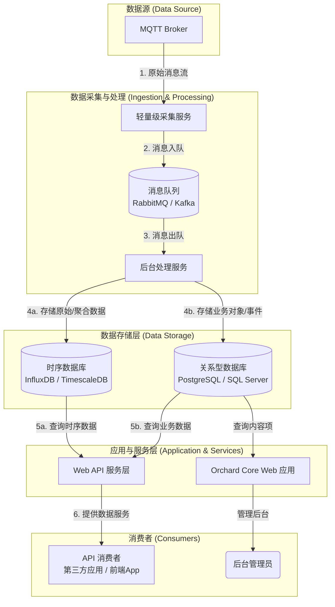

# 基于Orchard Core的MQTT物联网数据平台架构设计方案

## 1. 摘要

本文档旨在为基于Orchard Core框架构建一个健壮、可扩展的MQTT物联网数据平台提供一套完整的设计方案。传统的将数据采集与Web应用紧耦合的方案在性能、可靠性和可伸缩性方面存在巨大挑战。为此，我们提出一种**解耦的、事件驱动的架构**。该架构以**消息队列**为核心，实现了数据采集、处理和服务的有效分离，并采用**混合数据存储策略**以应对不同类型数据的存储需求，最终通过灵活的**Web API层**对外提供数据服务。

## 2. 核心挑战：紧耦合架构的风险

在探讨推荐架构之前，必须先理解直接在MQTT消息回调中调用Orchard Core `IContentManager`创建内容项（紧耦合方案）所面临的风险：

- **性能瓶颈**：`PublishAsync`是一个相对较重的操作，高并发的消息将迅速压垮Web服务器和数据库。
- **数据丢失**：任何在处理过程中的应用重启、数据库故障或代码异常都可能导致消息的永久丢失。
- **缺乏弹性**：数据采集的流量高峰会直接冲击主Web应用，无法独立扩展系统的不同部分。
- **逻辑僵化**：难以实现数据聚合、清洗、转换等复杂业务逻辑，所有原始数据都必须创建为内容项。

## 3. 推荐架构：解耦的、事件驱动的平台

为了克服以上挑战，我们设计了如下的解耦架构。

### 3.1 架构总览图

### 3.2 核心组件详解

1.  **轻量级采集服务 (Ingestion Service)**
    - **职责**：作为数据的入口，唯一任务是订阅MQTT主题，并将收到的原始消息快速、可靠地推送到消息队列中。
    - **特点**：无业务逻辑，轻量、稳定，易于水平扩展。

2.  **消息队列 (Message Queue)**
    - **职责**：作为系统的数据总线和缓冲区，核心作用是解耦生产者（采集服务）和消费者（处理服务）。
    - **特点**：
        - **削峰填谷**：平滑处理流量高峰，保护下游系统。
        - **可靠传输**：保证消息在处理服务可用之前不会丢失。
        - **异步通信**：允许各组件独立工作。

3.  **后台处理服务 (Processing Service)**
    - **职责**：系统的“大脑”，从消息队列中消费数据，并执行所有核心业务逻辑。
    - **业务逻辑示例**：
        - 数据清洗、验证与格式转换。
        - 数据聚合（例如，计算5分钟平均值）。
        - 规则引擎判断（例如，温度超过阈值则触发报警）。
        - 决定数据最终的存储目的地。

4.  **数据存储层 (Data Storage Layer)**
    - 采用混合存储策略，将不同类型的数据存入最适合它们的数据库中。

5.  **Web API 服务层 (Web API Service Layer)**
    - **职责**：作为统一的数据出口，根据外部请求，从数据存储层查询数据，并以约定的格式（如JSON）返回。

6.  **Orchard Core Web 应用**
    - **职责**：回归其核心优势——内容管理和业务展现。
    - **用途**：管理设备信息、报警规则、用户权限等核心业务对象；为后台管理员提供数据报表、设备状态监控等可视化界面。

## 4. 数据存储策略

我们推荐使用混合存储，以最大化性能和效率。

| 数据库类型 | 推荐用途 | 优势 | 示例数据库 |
| :--- | :--- | :--- | :--- |
| **时序数据库 (TSDB)** | 存储高频率、大量的原始遥测数据、日志数据。 | 写入速度快，查询效率高，存储压缩率高，内置强大的时间维度分析函数。 | InfluxDB, TimescaleDB |
| **关系型数据库 (Orchard Core DB)** | 存储低频率、高价值的结构化业务对象或处理结果。 | 事务一致性强，适合复杂关联查询，可利用Orchard Core的CMS能力。 | PostgreSQL, SQL Server |

**数据分配示例**：
- **存入TSDB**：`{ "deviceId": "T-101", "timestamp": "...", "temperature": 25.3 }`
- **存入Orchard Core DB**：创建一个`Alert`内容项，包含字段：`DeviceId`, `AlertType`, `Timestamp`, `Message`。

## 5. Web API 服务层设计

对于API层的实现，我们有两个主要方案可供选择。

| 评估维度 | 方案A：内嵌于Orchard Core | 方案B：作为独立服务部署 |
| :--- | :--- | :--- |
| **开发效率** | **高**。复用现有项目和认证体系。 | **中**。需要创建和配置新项目。 |
| **性能隔离** | **差**。API的高负载会影响CMS性能。 | **优**。可独立扩展，互不影响。 |
| **部署复杂度** | **低**。随主应用一同部署。 | **高**。需要维护独立的部署流水线。 |
| **认证授权** | **简单**。无缝集成Orchard Core用户和权限体系。 | **复杂**。需要独立实现或集成认证方案（如JWT）。 |
| **推荐场景** | **项目初期、中低负载、快速迭代**。 | **高负载、微服务架构、需要独立团队维护**。 |

**结论**：建议从**方案A**起步，以获得最高的开发效率。当未来API负载成为瓶颈时，再平滑地将其重构为**方案B**。

## 6. 实施路线图

建议分阶段实施此架构：

1.  **阶段一：核心管道搭建 (MVP)**
    - 部署MQTT Broker和消息队列。
    - 开发轻量级采集服务，实现消息入队。
    - 开发后台处理服务，实现消息消费，并先用日志打印来验证逻辑。

2.  **阶段二：存储与服务化**
    - 部署时序数据库和关系型数据库。
    - 在处理服务中实现将数据写入两个数据库的逻辑。
    - 在Orchard Core中创建API模块（方案A），提供初步的数据查询API。

3.  **阶段三：完善与优化**
    - 在Orchard Core中开发管理界面，用于设备管理和数据显示。
    - 为API增加缓存、限流等策略。
    - 根据负载情况，考虑是否需要将API层独立出去（方案B）。

## 7. 总结

本方案通过引入消息队列实现了系统组件的全面解耦，通过混合存储策略优化了数据管理效率，并通过分层设计明确了各部分的职责。该架构不仅解决了紧耦合方案的性能和可靠性问题，更为平台未来的功能扩展和性能优化奠定了坚实的基础，是构建企业级物联网数据平台的理想选择。